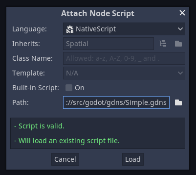

This binding uses [Gradle](https://gradle.org) as its build tool and you will need version 6.0 or higher installed. The next requirement is to have a Godot project (obviously!), if you don't have it yet please create one.

Open a terminal and `cd` to root directory of your Godot project.

## Wrapper
On this step, we will be setting up a Gradle [wrapper](https://docs.gradle.org/current/userguide/gradle_wrapper.html). The wrapper will ensure that anyone who wants to build your project from source will use the same gradle version.

```shell
touch build.gradle.kts gradle.properties settings.gradle.kts
```

The above command will create three files, which will be empty for now.

```shell
gradle wrapper --gradle-version=6.1.1
```

That is it, you have the wrapper installed! The command will produce several files but the important ones are `gradlew` and `gradlew.bat`. Moving forward we will be using `gradlew` to run gradle (`gradlew.bat` on Windows). The first time `gradlew` is used it will download the gradle version you have specified before.

## Setup
Once you have the wrapper installed, we need to setup the Gradle plugin this binding provides. Without the plugin, you will have to manually generate the entry point, `.gdnlib` and `.gdns` files.

```kotlin
plugins {
    kotlin("multiplatform") version "$kotlinVersion"
    id("com.github.raniejade.godot-kotlin") version "$godotKotlinVersion"
}

repositories {
    jcenter()
    mavenCentral()
}

godot {
    libraries {
        val simple by creating {}
    }
}
```

In the above example, you are telling the plugin to create a library (that can be used in godot) with a name `simple`. The source directory of the library is at `src/<library_name>Main/kotlin`.

Up next, let's create a file `src/simpleMain/kotlin/Simple.kt` with the following contents.

```kotlin
import godot.*
import godot.core.*

class Simple: Spatial() {
  override fun _ready() {
    gprint("Hello Godot from Kotlin!")
  }

  companion object: GodotClass<Spatial, Simple>(::Simple) {
    override fun init(registry: ClassMemberRegistry<Simple>) {
      with(registry) {
        registerMethod(Simple::_ready)
      }
    }
  }
}
```

There's a lot to process here, but let us forget about it for now. Everything will be explained in the [classes](../user-guide/classes.md) section of user guide.

We need to tell the plugin that we want expose `Simple` to godot, which can be done by doing the following.

```kotlin
godot {
    libraries {
        val simple by creating {
          classes("Simple")
        }
    }
}
```

!!! note ""
    The plugin automatically generates the appropriate `gdnlib` and `gdns` files which can be found at `src/godot/gdnlib` and `src/godot/gdns`, respectively. It is up to you whether you want to include those files in source control or not.
    
Now we can trigger a build.

```shell
./gradlew build
``` 


Once the build is done, two files will be generated: `src/godot/gdns/Simple.gdns` and `src/godot/gdnlib/Simple.gdnlib`. You can use `Simple.gdns` in Godot when assigning a script to a node.



## Configuring target platforms

By default the plugin is configured to build all [supported platforms](supported-platforms.md). This can be changed via the `platforms` property of the library.

```kotlin
godot {
  libraries {
    val simple by creating {
      platforms(TargetPlatform.WINDOWS)
      ...
    }
  }
}
```

## Editor plugins
    
Godot editor plugins is fully managed by the gradle plugin, therefore it is recommended to exclude the `addons` folder from your VCS (add it to `.gitignore` if you are using git). Installing a plugin is done by adding a dependency to the `godotPlugin` configuration.

```kotlin
dependencies {
  godotPlugin("com.example:editor-plugin:0.1.0")
}
```

Project and file dependencies are also supported.

```kotlin
dependencies {
  godotPlugin(project(":editor-plugin"))
  godotPlugin(file("thirdparty/some-plugin.zip"))
}
```

!!! note ""
    Project dependency must be a plugin project, see [Editor Plugin](editor-plugin.md) of the setup section for details on how to setup one.

An `initPlugins` task is provided by the gradle plugin which will extract all plugins to the `addons` directory of your project.

## Running godot
The gradle plugin also provides a task that will download and run a specific version of Godot. By default, this version is set to the version of Godot this binding is built against. The version can be customized via the `godotVersion` property of the `godot` extension.

```kotlin
godot {
  godotVersion.set("3.2-rc1")
}
```

Running the task can be done by (this will also setup any editor plugins your project needs):

```
./gradlew runGodot
```